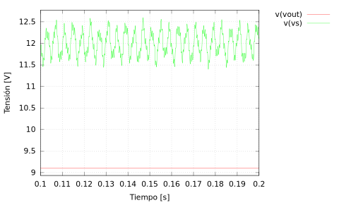
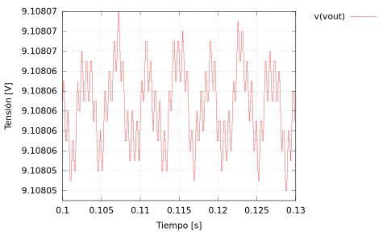
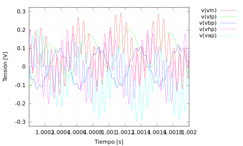
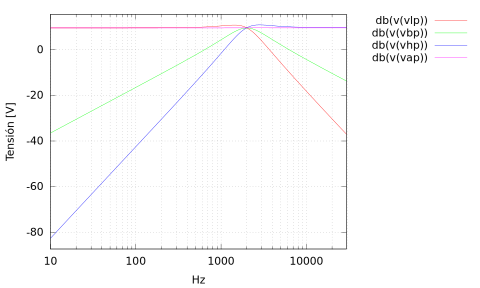
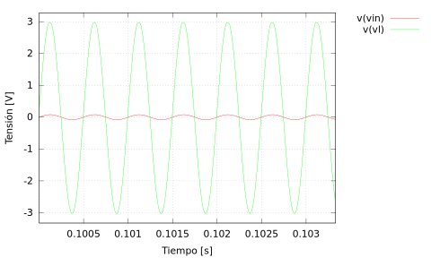
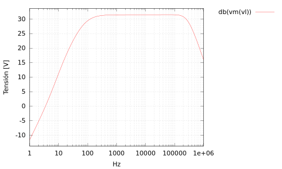

# Separador de frecuencias de Audio
## Proyecto Final de Laboratorio Eléctrico I

Se realiza un circuito que separa frecuencias bajas, medias y altas, esto con el fin de proporcionar una mejor experiencia de sonido en cajas que cuentan con parlantes especializados para cada banda de frecuencia.

El circuito se alimenta con 24V(dos fuentes de 12V cada una), y se regula internamente a +-9V.

La señal de audio se obtiene con un jack estandar de 3.5mm, igual que las salidas.

### Simulaciones Realizadas

Para obtener las gráficas de la simulaciones correr ```./exec.sh```, se debe tener ngspice, gnuplot e inkscape.

#### Etapa de Regulación
_Del archivo ```spices/fuente.cir```_

Se utiliza el diseño propuesto por el fabricante.

Se puede regular bastante bien independeientemente de las variaciones en la fuente, en la simulación esta varía entre 11.5V y 12.5V



El Ruido presente en la salida de la regulación es mínimo, esto se aprecia en la siguiente figura:



#### Etapa de Filtrado
_Del archivo ```spices/filtro.cir```_

Se tiene la frecuencia de corte en 2kHz. Las respuestas pasa bajos y pasa altos son de segundo orden, la respuesta pasabandas es de primer orden.




#### Etapa de amplificación
_Del archivo ```spices/powamp.cir```_

Se utiliza el diseño propuesto por el fabricante.



